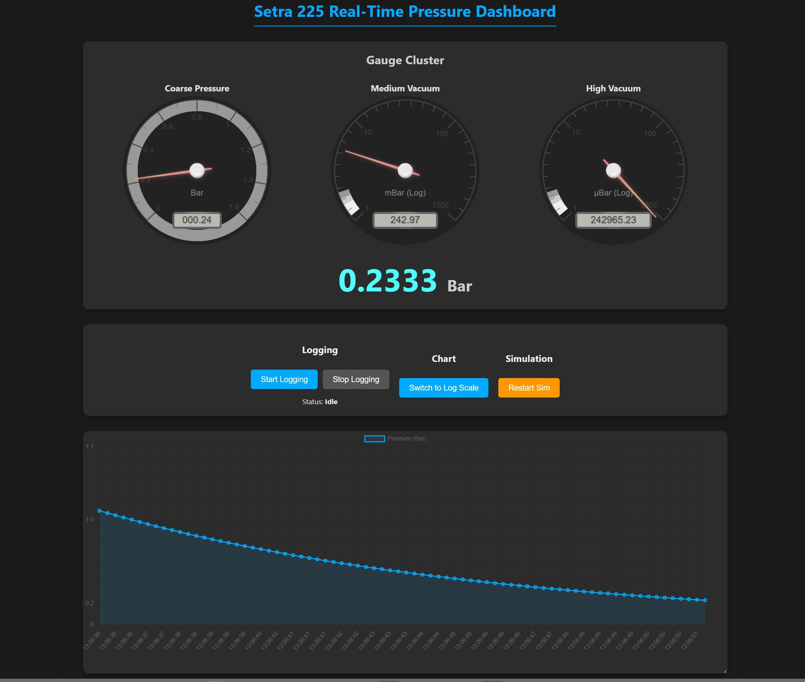

# Setra 225 Real-Time Pressure Dashboard

This project reads data from a Setra Model 225 (4-20mA) pressure sensor using an Arduino, sends the data to a Python Flask server, and displays it on a real-time web dashboard with gauges and a graph.

## 1. Hardware Setup

Correct wiring is essential for this project to work. Your sensor is a **4-20mA current loop sensor**, which cannot be connected directly to the Arduino. You must use a **250-ohm precision resistor** to convert the current signal to a voltage signal.

**Components:**
*   Arduino Uno (or compatible)
*   Setra 225 Sensor (PN: 225G1R7BAC411, 0-1.7 Bar, 4-20mA)
*   A power supply for the sensor (e.g., 12V or 24V DC)
*   A 250-ohm precision resistor (1% tolerance or better is recommended)
*   Jumper wires

**Wiring Diagram:**

```
+------------------+         +----------------------+       +----------------+
|                  |         |                      |       |                |
|  Sensor 12/24V   |-------->| Sensor V+ (Power)    |       |                |
|  Power Supply    |         |                      |       |                |
|      (-)         |--+----->| Sensor V- (Ground)   |       |  Arduino Uno   |
+------------------+  |      |                      |       |                |
                      |      |    Sensor Output (+) |---+-->| Pin A0         |
                      |      +----------------------+   |   |                |
                      |                                 |   |                |
                      +---------------------------------+-->| GND            |
                                                        |   +----------------+
                                                        |
                                                     +--+---+
                                                     |      |
                                                     R=250Ω
                                                     |      |
                                                     +--+---+
                                                        |
                                                        +-----> GND (Connected to Arduino and Power Supply Ground)
```

**Wiring Steps:**
1.  **Power the Sensor:** Connect the sensor's power input (`V+`) and ground (`V-`) to your DC power supply.
2.  **Create the Resistor Bridge:**
    *   Connect the sensor's **output wire** to one leg of the **250-ohm resistor**.
    *   Connect the other leg of the resistor to **Ground**.
3.  **Connect to Arduino:**
    *   Connect Arduino **Pin A0** to the point where the sensor output wire and the resistor meet.
    *   Connect an Arduino **GND** pin to the common ground of your circuit (the power supply ground and the low side of the resistor).

---

## 2. Software Setup

### A. Upload Arduino Sketch
1.  Open the [`Setra225_Pressure_Sensor.ino`](Setra225_Pressure_Sensor.ino:1) file in the Arduino IDE.
2.  Connect your Arduino to your computer via USB.
3.  Select the correct board (`Arduino Uno`) and port (`COMx` or `/dev/tty...`) from the `Tools` menu.
4.  Click the "Upload" button.

### B. Install Python Libraries
1.  Open a terminal or command prompt.
2.  **(First-time setup)** It's good practice to ensure you have the latest packaging tools. Run this command first:
    ```bash
    python -m pip install --upgrade pip setuptools wheel
    ```
3.  Install the required Python packages for the project:
    ```bash
    pip install Flask Flask-SocketIO pyserial
    ```

---

## 3. Running the Dashboard

### A. Configure the Serial Port
1.  In the Arduino IDE (after uploading), check the `Tools > Port` menu to see which COM port your Arduino is using (e.g., `COM3`).
2.  Open the [`server.py`](server.py:1) file.
3.  On **line 9**, change the `SERIAL_PORT` variable to match the port you found.
    ```python
    # e.g., change "COM3" to your actual port
    SERIAL_PORT = "COM3"
    ```

### B. Start the Server
1.  In your terminal, navigate to the project directory.
2.  Run the Python server script in either **Live Mode** or **Simulation Mode**.

*   **Live Mode (Default)**
    *   Reads data from the connected Arduino.
    *   Run the script normally:
    ```bash
    python server.py
    ```

*   **Simulation Mode**
    *   Generates simulated vacuum data without needing an Arduino.
    *   Useful for testing the dashboard display.
    *   Run the script with the `--simulate` flag:
    ```bash
    python server.py --simulate
    ```
You should see output indicating that the server is running and attempting to connect to the serial port.

### C. View the Dashboard
1.  Open your web browser.
2.  Navigate to the following address:
    [http://127.0.0.1:5000](http://127.0.0.1:5000)

You should now see the dashboard, and it will update in real-time!

**Note on Visualization:** To properly display the wide range of pressures from 1 bar down to microbars, the gauge and chart use a **logarithmic scale**.

### D. Data Logging
The dashboard includes controls for logging data to a CSV file. This works in both Live and Simulation modes.
*   **Start Logging:** Click this button to begin saving data. A new file named `pressure_log_YYYYMMDD_HHMMSS.csv` will be created in the project directory. The status on the dashboard will update to show the active filename.
*   **Stop Logging:** Click this button to close the current CSV file.
*   You can start and stop logging as many times as you like; a new file will be created each time you click "Start Logging".
